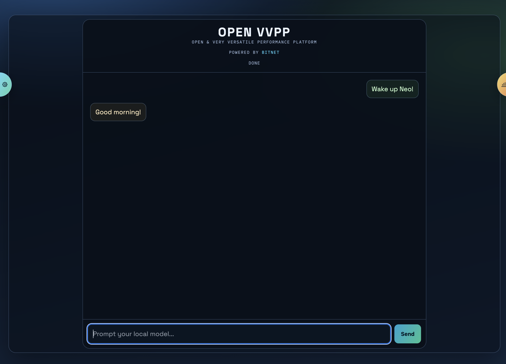
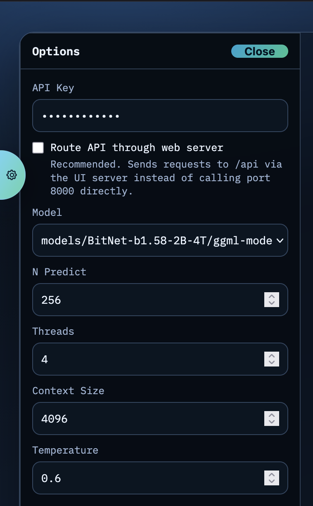
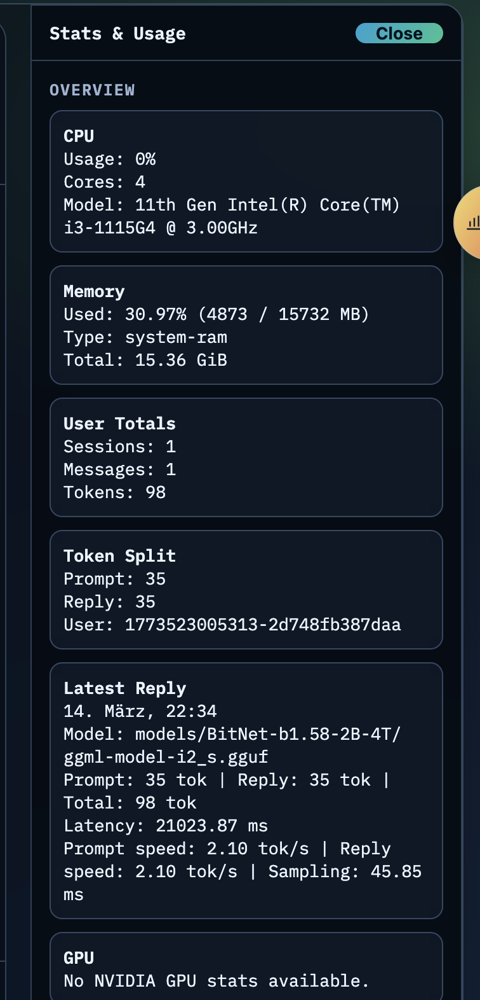
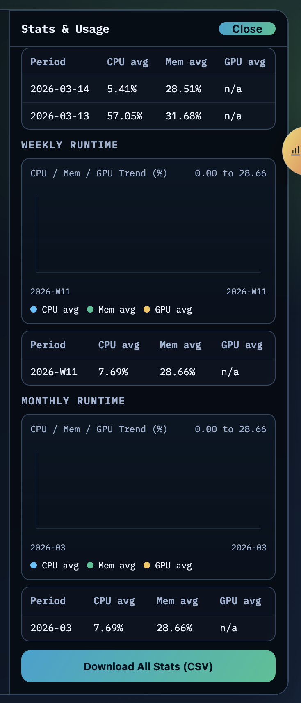

# OPEN VVPP - open & very versatile performance platform

This is a ready-to-run implementation of Microsoft's [bitNet](https://github.com/microsoft/bitNet) framework. It allows you to run bitnet.cpp - an inference framework for 1-bit LLMs - on weak hardware. 

## Overview

- OPEN VVPP wraps around bitNet and provides a web interface for managing models, conversations, and settings.



- it's "protected" by an API key, but as the focus is to run it locally on your NAS or PC, the API key is the only serious security measure here - no user accounts, no permissions, no authentication, no encryption, no rate limits, no nothing to hardend it



- you also get a couple of statistical insights about your usage, and the option to share them anonymously with the community





## Quick start

Run:

```bash
curl -fsSL https://raw.githubusercontent.com/nickyreinert/bitNetRTR/main/install.sh | bash
```

What this does:

- downloads `install.sh`
- asks where to install: `~/.local/share/bitNetRTR` or current folder
- clones/updates the repository in the selected location
- checks for `git` and `docker compose` (does not install host packages)
- runs the project in Docker-only mode (`--skip-install-deps`)
- hands off to the project-local `bitNetRTR.sh`

## After install

- check `config.yaml` for configuration options, you may add and configure models there
- run `bitNetRTR.sh` to start and maintain the server
- in the wrapper menu, use `Download model(s) (container)` to fetch selected supported models on demand

